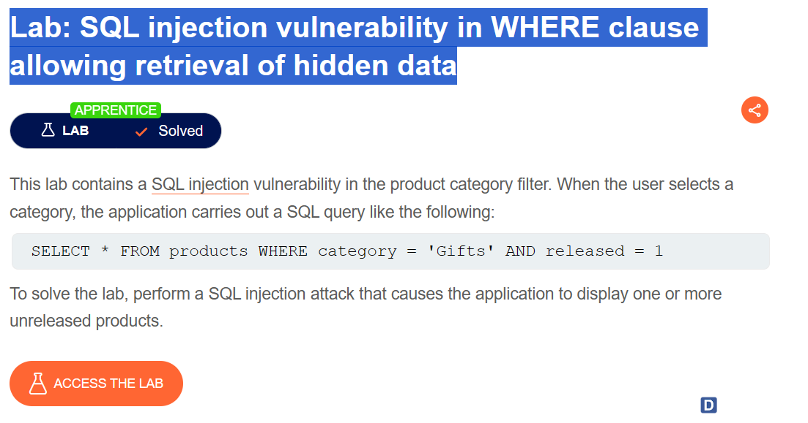

# `<!DOCTYPE html>`

- Dùng để khai báo phiên bản đang sử dụng là HTML

# `<head>`

- không hiển thị nội dung cho người dùng trên trình duyệt, mà chứa các thông tin mô tả, định dạng và kết nối với các tài nguyên khác của trang web.

# `<meta>`

- charset: Xác định bộ mã hóa (character encoding) được sử dụng trong trang web, thường là UTF-8 để hỗ trợ các ký tự đa ngôn ngữ.
- name: Xác định tên của thông tin được định nghĩa, ví dụ: "description", "keywords", "author", "viewport",...
- content: Chứa giá trị của thông tin được định nghĩa.

# `<title>`

- tiêu đề của trang web
